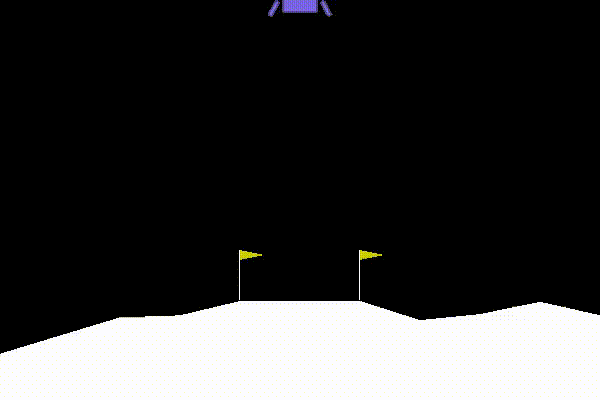
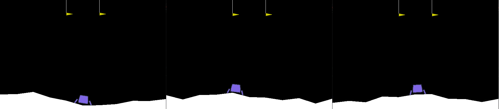
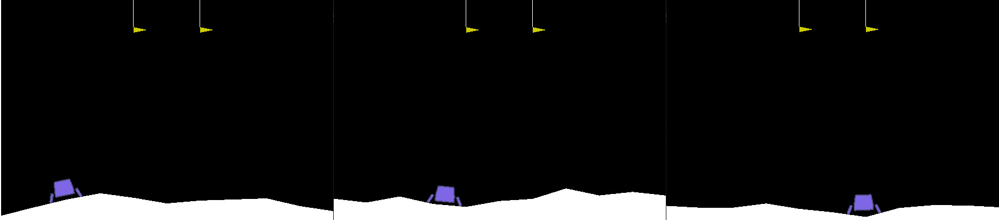

<h2 align="center">Smarthop machine learning position (technical assessment)</h2>

Below steps for technical assessment solution, are described:

<!-- QUESTIONS 1 AND 2 -->
## Training and test agent in lunar lander environment with DQN stable baselines algorithm

1. Stable baselines module was installed using anaconda to support Tensorflow 1.8. 
2. DQN agent was trained using DQN stable baselines algorithm with learning_rate = 0.003 and time_steps = 500000
3. After learning stage, agent was tested loading l_lander_dqn.zip file. Below is a gif with recording result

Python file `lunar_lander_dqn.py` check if previous training model exists (`l_lander_dqn.zip`). If exists, run test environment with the learning file. If not exists, agent is trained with DQN argorithm (stable baselines).

<!-- QUESTION 3 -->
## Customize environment

Environment lunar lander was customized in python file `lunar_launcher_env.py`. Lunar launcher environment goal is reach the top center of screen environment (between flags). It make random terrains, simulating random launch started angles. If `set_random_x_pos=False` always will start in ground center (see image below).

If `set_random_x_pos=True` agent will start in random ground positions along x axis (see image below).

To allow the performance of an agent in this environment, it was necessary to make some changes, which are described below:

- Friction was increased to allow a fixed started position
- Collision ground detector was removed, when agent reach to top, game over
- Main engine power was decreased to promote use of right and left engines, it force agent to fly to reach correct launch angle and position
- Observation space was reduced to 6, observations related with contact ground detection were removed
- Rewards system was changed, to promote movement and reach the center top
